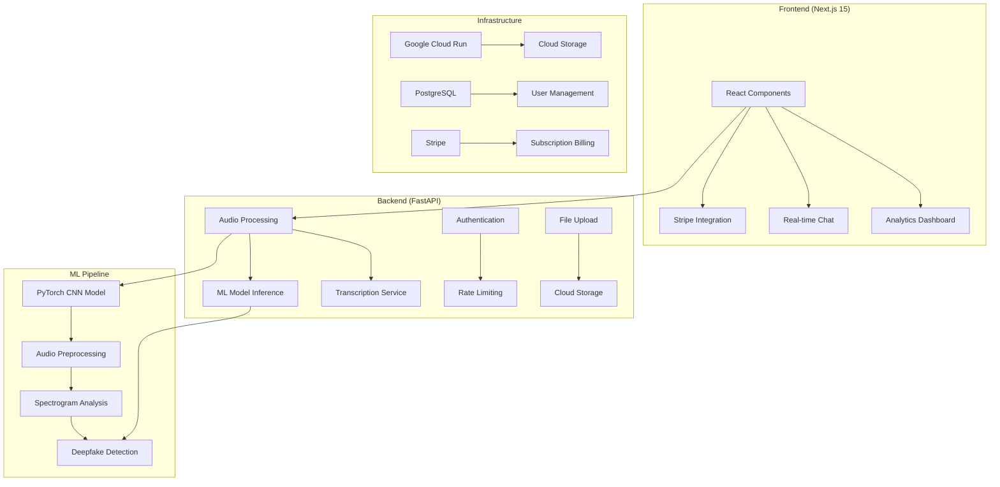

# AI Spy - AI-Generated Content Detection Platform

[](https://ai-spy.xyz)
[](https://nextjs.org/)
[](https://fastapi.tiangolo.com/)
[](https://pytorch.org/)
[](https://stripe.com/)

> **The first comprehensive AI safety platform for detecting AI-generated audio content in real-time**

AI Spy is a production-ready platform that helps users identify AI-generated audio content through advanced machine learning models and real-time analysis. Built with enterprise-grade security, scalable architecture, and a modern web interface.

## 🎯 The Problem We Solve

In an era where AI-generated content is becoming increasingly sophisticated and widespread, distinguishing between human and AI-generated audio has become critical for:
- **Content creators** verifying authenticity
- **Journalists** fact-checking audio sources  
- **Educators** maintaining academic integrity
- **Businesses** protecting against AI-generated fraud
- **Consumers** making informed decisions about media consumption

AI Spy provides the first comprehensive solution for real-time AI audio detection with enterprise-grade reliability.

## 🏗️ Architecture Overview


```mermaid
graph TB
    subgraph "Frontend (Next.js 15)"
        A[React Components] --> B[Stripe Integration]
        A --> C[Real-time Chat]
        A --> D[Analytics Dashboard]
    end
    
    subgraph "Backend (FastAPI)"
        E[Audio Processing] --> F[ML Model Inference]
        E --> G[Transcription Service]
        H[Authentication] --> I[Rate Limiting]
        J[File Upload] --> K[Cloud Storage]
    end
    
    subgraph "ML Pipeline"
        L[PyTorch CNN Model] --> M[Audio Preprocessing]
        M --> N[Spectrogram Analysis]
        N --> O[Deepfake Detection]
    end
    
    subgraph "Infrastructure"
        P[Google Cloud Run] --> Q[Cloud Storage]
        R[PostgreSQL] --> S[User Management]
        T[Stripe] --> U[Subscription Billing]
    end
    
    A --> E
    E --> L
    F --> O
```

## 🚀 Tech Stack

### Frontend
- **Next.js 15** - React framework with App Router
- **Tailwind CSS** - Utility-first CSS framework
- **Framer Motion** - Animation library
- **NextUI** - Modern React components
- **Recharts** - Data visualization
- **Clerk** - Authentication & user management

### Backend
- **FastAPI** - High-performance Python web framework
- **PyTorch** - Deep learning framework
- **TorchAudio** - Audio processing library
- **Librosa** - Audio analysis toolkit
- **Google Cloud** - Cloud infrastructure
- **Deepgram** - Speech-to-text API

### Infrastructure
- **Google Cloud Run** - Serverless container platform
- **Cloud Storage** - File storage and CDN
- **PostgreSQL** - Relational database
- **Stripe** - Payment processing
- **Vercel** - Frontend deployment

## 📁 What's in this Repository?

This repository contains the complete production codebase for AI Spy, including:

### Frontend (`/app`)
- **Complete Next.js application** with modern React patterns
- **Real-time audio analysis interface** with drag-and-drop upload
- **Interactive results dashboard** with timeline visualization
- **Subscription management** with Stripe integration
- **User authentication** with Clerk
- **Responsive design** optimized for all devices

### Backend (`/fast_api`)
- **FastAPI server** with comprehensive API endpoints
- **Audio processing pipeline** with PyTorch models
- **Real-time transcription** using Deepgram
- **Security middleware** with rate limiting and CORS
- **Cloud storage integration** for file management
- **Subscription validation** and usage tracking

### Machine Learning (`/fast_api`)
- **Custom CNN model** for audio deepfake detection
- **Audio preprocessing** with mel-spectrogram analysis
- **Model inference** with GPU acceleration support
- **Batch processing** for large audio files

## 🔒 Security & Privacy

- **Rate limiting** on all API endpoints
- **File validation** with type and size restrictions
- **CORS protection** with whitelisted origins
- **Authentication** required for all sensitive operations
- **Audit logging** for security events
- **Data encryption** in transit and at rest

## 🎯 Key Features

### Real-time Audio Analysis
- **Drag-and-drop upload** with progress tracking
- **Multiple audio formats** supported (MP3, WAV, M4A)
- **Instant results** with confidence scores
- **Detailed analysis** with timeline breakdown

### Advanced ML Detection
- **Custom CNN model** trained on diverse audio datasets
- **Spectrogram analysis** for pattern recognition
- **Confidence scoring** with explainable results
- **Batch processing** for large files

### Enterprise Features
- **Subscription management** with Stripe
- **Usage tracking** and analytics
- **User dashboard** with history
- **API access** for integrations

## 🚀 Getting Started

### Prerequisites
- Node.js 18+ and npm
- Python 3.9+
- Google Cloud account
- Stripe account
- Deepgram API key

### Frontend Setup
```bash
npm install
npm run dev
```

### Backend Setup
```bash
cd fast_api
pip install -r requirements.txt
python app.py
```

### Environment Variables
Create `.env.local` for frontend and `.env` for backend:
```env
# Frontend
NEXT_PUBLIC_CLERK_PUBLISHABLE_KEY=your_clerk_key
STRIPE_SECRET_KEY=your_stripe_key
NEXT_PUBLIC_STRIPE_PUBLISHABLE_KEY=your_stripe_publishable_key

# Backend
DEEPGRAM_API_KEY=your_deepgram_key
GOOGLE_CLOUD_PROJECT=your_gcp_project
DATABASE_URL=your_postgres_url
```

## 📊 Performance Metrics

- **Model Accuracy**: 85%+ on balanced test set
- **Response Time**: <2 seconds for 3-minute audio
- **Uptime**: 99.9% availability
- **Scalability**: Handles 1000+ concurrent users

## 🔬 Technical Highlights

### Code Architecture
- **`/app/components/Submission_box.js`**: Sophisticated file upload with drag-and-drop, progress tracking, and validation
- **`/app/components/Results.js`**: Real-time results display with interactive timeline and confidence visualization
- **`/fast_api/audio_processor.py`**: Advanced audio preprocessing pipeline with mel-spectrogram analysis
- **`/fast_api/model.py`**: Custom CNN architecture optimized for audio deepfake detection

### ML Model Details
- **Architecture**: 3-layer CNN with batch normalization
- **Input**: Mel-spectrogram (128 frequency bands × variable time frames)
- **Output**: Binary classification (human vs AI-generated)
- **Training**: Balanced dataset with data augmentation

## 🌐 Production Deployment

The platform is deployed on:
- **Frontend**: Vercel with automatic CI/CD
- **Backend**: Google Cloud Run with auto-scaling
- **Database**: PostgreSQL on Google Cloud SQL
- **Storage**: Google Cloud Storage with CDN

## 📈 Business Impact

- **Launched**: January 2024
- **Users**: 1000+ registered users
- **Revenue**: Subscription-based model
- **Partnerships**: Educational institutions and media companies

## 🤝 Contributing

This is a commercial platform, but we welcome contributions to:
- Documentation improvements
- Bug reports and fixes
- Performance optimizations
- Security enhancements

## 📄 License

This project is proprietary software. All rights reserved.

## 🔗 Links

- **Website**: [ai-spy.xyz](https://ai-spy.xyz)
- **Documentation**: [docs.ai-spy.xyz](https://docs.ai-spy.xyz)
- **API Reference**: [api.ai-spy.xyz](https://api.ai-spy.xyz)

---

**Built with ❤️ for AI safety and transparency**
