## AI‑SPY — Audio Authenticity Analyzer

[](https://nextjs.org/)
[](https://fastapi.tiangolo.com/)
[](https://pytorch.org/)
[](https://deepgram.com/)
[](https://ai.google.dev/)
[](https://stripe.com/)
[]()

Bold audio authenticity. Clear, actionable insight.

Links: [Website](https://ai-spy.xyz) · [Live App](https://app.ai-spy.xyz)


### Why AI‑SPY
The world is getting louder — and less trustworthy. AI‑generated audio can be produced in minutes and spread in seconds. AI‑SPY helps journalists, educators, creators, and teams quickly assess the likelihood that an audio clip was AI‑generated and communicate that finding with confidence.

### What you get
- **Real‑time analysis**: Upload an audio file and get per‑3s segment predictions with confidence scores, fast.
- **Explainable timeline**: A clean timeline highlighting AI vs human segments — ideal for reports and presentations.
- **Transcription + sentiment**: Automatic transcripts with word‑level timestamps and sentiment via Deepgram.
- **Actionable summaries**: Instant summary stats for fast decision‑making.
- **Ask‑an‑Analyst chat**: Chat about the analysis and transcript to refine understanding (Gemini).

---

## 📱 Overview

AI‑SPY is an end‑to‑end audio authenticity analyzer:

- Frontend: Next.js 15 app with a polished UI (NextUI + Tailwind) and an explainable results surface (timeline, transcription, content analysis, and chat).
- Backend: FastAPI service that secures uploads, runs ML inference with a custom PyTorch model (STAC‑2.2), integrates with Deepgram for transcription, and gates features via Stripe subscriptions.
- Infra: Optional GCS Signed URLs for uploads and Cloud Tasks for asynchronous report processing.

---

## 🏗️ Architecture

```mermaid
graph LR
  subgraph "Browser + Next.js"
    NUI["Upload UI + Timeline + Chat"]
    NXAPI["Next API routes (/api/*)"]
  end

  subgraph "FastAPI (Cloud Run container)"
    FAPI["FastAPI REST API"]
    WORKER["/process-report worker (same service)"]
  end

  subgraph "GCP"
    GCS(("Cloud Storage (GCS)"))
    TASKS(("Cloud Tasks queue"))
  end

  subgraph "Third‑party APIs"
    DG["Deepgram"]
    GEM["Gemini"]
    STR["Stripe"]
  end

  NUI --> NXAPI
  NXAPI -->|"/api/auth/token → proxies"| FAPI
  NUI -->|"Bearer token"| FAPI
  FAPI -->|"v4 signed URL"| NUI
  NUI -->|"PUT (signed URL)"| GCS

  NUI -->|"POST /report {bucket,file}"| FAPI
  FAPI -->|"create"| TASKS
  TASKS -->|"HTTP POST"| WORKER
  WORKER -->|"download"| GCS
  WORKER -->|"transcribe"| DG
  WORKER -->|"ML inference"| WORKER
  WORKER -->|"store status/result"| FAPI
  NUI -->|"poll /report-status/{task}"| FAPI

  NXAPI <--> STR
  FAPI --> GEM
```



### How it works
1) Token via proxy: Client calls `POST /api/auth/token`; Next proxies to FastAPI `POST /auth/token` and returns a short‑lived HMAC token. The client includes `Authorization: Bearer <token>` for FastAPI calls.
2) Signed upload: Client requests `POST /generate-upload-url { file_name, file_type }`. FastAPI sanitizes the name, validates extension/MIME/magic bytes, and returns a GCS V4 signed PUT URL and unique object name.
3) Direct upload to GCS: Client uploads the file via HTTP PUT to the signed URL (expires in ~10s).
4) Queue report: Client calls `POST /report { bucket_name, file_name }`. FastAPI enqueues a Cloud Task targeting `WORKER_URL/process-report` (Cloud Run) with a 300s deadline.
5) Worker processing: The worker downloads from GCS, calls Deepgram “nova‑2” for transcript, word‑timestamps, sentiment, and summary, then windows audio into 3‑second non‑overlapping chunks, computes log‑mel spectrograms, and infers chunk‑level AI probability via a CNN. It aggregates percent AI/Human and sets the overall verdict (AI/Human/Mixed/Uncertain). Results are stored in‑memory by `task_id`.
6) Poll + render: Client polls `GET /report-status/{task_id}`. If no active subscription, response is limited (summary + a few timeline items, truncated transcript). The UI renders timeline, color‑coded transcript, summary stats, and an overall verdict.
7) In parallel: Client may call `POST /transcribe` for faster transcript; subscription checks run via `GET /api/check-subscription` (Next route talks to Stripe); chat uses `POST /chat` (Gemini) with per‑report quota for subscribers.

### Sequence

```mermaid
sequenceDiagram
  autonumber
  participant U as User (Browser)
  participant FE as Next.js App (Client)
  participant NX as Next API Routes (/api/*)
  participant BE as FastAPI (Cloud Run)
  participant GCS as Cloud Storage
  participant CT as Cloud Tasks
  participant WK as Worker (/process-report)
  participant DG as Deepgram
  participant STR as Stripe

  U->>FE: Select/drag-drop audio file
  FE->>NX: POST /api/auth/token
  NX->>BE: POST /auth/token
  BE-->>NX: { token, expires_in }
  NX-->>FE: { token }
  FE->>BE: POST /generate-upload-url (Bearer token)
  BE-->>FE: { signed_url, file_name, bucket }
  FE->>GCS: PUT file to signed_url
  par In parallel
    FE->>BE: POST /report { bucket, file_name }
    FE->>BE: POST /transcribe (multipart) [optional gating]
  and
    FE->>NX: GET /api/check-subscription
    NX->>STR: Verify customer/subscription
    STR-->>NX: Active? details
    NX-->>FE: { hasSubscription }
  end
  BE->>CT: Enqueue task → /process-report
  CT->>WK: HTTP POST (task payload)
  WK->>GCS: Download object
  WK->>WK: Normalize + 3s windows + PyTorch inference
  WK->>DG: Transcribe + sentiment + summary
  WK-->>BE: Persist in-memory job status/results
  loop Polling
    FE->>BE: GET /report-status/{taskId}
    BE-->>FE: { status | result | limited-by-plan }
  end
  FE-->>U: Timeline grid, colored transcript, summary stats, overall verdict
```



### Modes: Local vs Production
- Local/dev: `POST /analyze` and `POST /transcribe` accept multipart uploads and respond synchronously; signed URLs and Cloud Tasks are optional/disabled unless configured. Run `uvicorn app:app --reload --port 8001` and set `NEXT_PUBLIC_FASTAPI_URL` and `FASTAPI_URL`.
- Production: FastAPI is containerized and deployed on Cloud Run; uploads use GCS signed URLs; long‑running work runs via Cloud Tasks invoking `/process-report` on Cloud Run. Use `TASKS_SHARED_SECRET` only for OSS demos—prefer Cloud Tasks OIDC in production.

---

## ⚙️ Tech Stack

### Frontend
- **Framework**: Next.js 15, React 18
- **UI**: Tailwind CSS, NextUI, Framer Motion, React Icons
- **Charts**: Recharts
- **Auth**: Clerk
- **State**: React hooks + `SubscriptionContext`

### Backend
- **Framework**: FastAPI + Uvicorn
- **ML**: PyTorch 2.5, Torchaudio, Librosa
- **Transcription**: Deepgram SDK
- **LLM**: Google Generative AI (Gemini)
- **Security**: slowapi rate limiting + strict security headers + CORS
- **Cloud (optional)**: GCS, Cloud Tasks
- **Billing**: Stripe (Checkout, Webhooks, Subscriptions)

---

## 🔐 Security & Modes

### OSS defaults
- Anonymous, signed tokens (not user‑bound)
- Subscription checks return false unless `STRIPE_SECRET_KEY` is set
- `/process-report` disabled unless `TASKS_SHARED_SECRET` is set
- CORS defaults to `http://localhost:3000`
- Logs omit user message content; client errors are generic

### Production notes (keep private)
- Integrate a real IdP/JWT
- Server‑side Stripe validation and webhook hardening
- Cloud Tasks authenticated delivery (OIDC) instead of shared secret

---

## 🧪 Features in this Repo

- Complete Next.js frontend: upload, progress UI, timeline grid, transcription view with risk‑coloring, content analysis, and chat assistant
- FastAPI endpoints for analysis, transcription, signed uploads, report queueing, status polling, and chat
- Stripe integration: pricing check, checkout, cancel/reactivate, billing history, and webhook receiver
- Strong file validation (extensions, MIME, magic bytes) and rate‑limited endpoints

---

## 🏃 Quick Start

### Prerequisites
- Node.js 18+
- Python 3.9+

### 1) Backend
```bash
cd fast_api
pip install -r requirements.txt
uvicorn app:app --reload --port 8001
```

Backend environment (`fast_api/.env`):
```env
# CORS
ALLOWED_ORIGINS=http://localhost:3000

# Auth (OSS demo will generate an ephemeral secret if missing)
JWT_SECRET=

# APIs
DEEPGRAM_API_KEY=
GOOGLE_AI_API_KEY=

# Google Cloud (optional)
GOOGLE_CLOUD_PROJECT=
CLOUD_TASKS_QUEUE=
CLOUD_TASKS_LOCATION=
GCS_BUCKET_NAME=
WORKER_URL=

# Enable /process-report in OSS (use OIDC in prod)
TASKS_SHARED_SECRET=

# Stripe (optional; enables server-side subscription validation)
STRIPE_SECRET_KEY=
```

Model weights: place `best_best_85_balanced.pth` in `fast_api/` (same directory as `app.py`). Proprietary weights are not included in this repo.

### 2) Frontend
```bash
npm install
npm run dev
```

Frontend environment (`.env.local`):
```env
# Where the Next.js client calls FastAPI
NEXT_PUBLIC_FASTAPI_URL=http://localhost:8001

# Server-side token proxy (Next API route → FastAPI)
FASTAPI_URL=http://localhost:8001

# App URL used in Stripe success/cancel redirects
NEXT_PUBLIC_APP_URL=http://localhost:3000

# Stripe (server-side)
STRIPE_SECRET_KEY=sk_test_...
STRIPE_MONTHLY_PRICE_ID=price_...
STRIPE_WEBHOOK_SECRET=whsec_...

# Clerk (if using a cloud project)
NEXT_PUBLIC_CLERK_PUBLISHABLE_KEY=pk_test_...
CLERK_SECRET_KEY=sk_test_...
```

Open `http://localhost:3000`.

---

## 💳 Stripe (Test Mode)

- Pricing endpoint: `app/api/subscription-price/route.ts`
- Checkout: `app/api/create-subscription/route.ts`
- Billing history: `app/api/billing-history/route.ts`
- Cancel/Reactivate: `app/api/cancel-subscription/route.ts`, `app/api/reactivate-subscription/route.ts`
- Webhook receiver: `app/api/webhook/stripe/route.ts`

Recommended local webhook forwarding:
```bash
stripe listen --forward-to localhost:3000/api/webhook/stripe
```

---

## 🔌 Backend API (selected)

- `POST /auth/token` — ephemeral client token
- `POST /generate-upload-url` — signed URL for uploads (GCS optional)
- `POST /analyze` — AI/human detection per 3s chunk
- `POST /transcribe` — transcripts with word timestamps + sentiment (Deepgram)
- `POST /report` → `GET /report-status/{task_id}` — queue and poll report processing
- `POST /chat` — Ask‑an‑Analyst (Gemini)
- `GET /chat-usage/{task_id}` — per‑report chat quota
- `GET /health` — health check

Security:
- Rate limits via `slowapi`
- Strict security headers (CSP, HSTS, XFO, etc.)
- Filename sanitization + content validation via magic bytes

---

## 🧩 Code Highlights

- Model inference: `fast_api/audio_processor.py` (PyTorch + Mel spectrograms)
- API core: `fast_api/app.py`
- Timeline and insights UI: `app/components/TimelineGrid.js`, `app/components/SummaryStats.js`
- Transcription overlay with risk‑coloring: `app/components/Transcription.js`
- Chat assistant: `app/components/Chat.js` + `app/utils/api.js`
- Subscription UX: `app/subscribe/page.tsx`, `app/billing/page.tsx`, `app/contexts/SubscriptionContext.js`

---

## 🧭 For Reviewers (Portfolio)

- End‑to‑end delivery: UX, API, ML, and billing integrated into a cohesive product.
- Explainability as a first‑class UX goal (timeline, colored transcript, summaries).
- Secure by default in OSS mode; clear upgrade path for production hardening.

---

## ✅ Pre‑publish checklist

- No secrets committed (use `.env`; commit `.env.example` only)
- `ALLOWED_ORIGINS` is restrictive; no wildcards by default
- `/process-report` disabled unless `TASKS_SHARED_SECRET` is set (prefer OIDC in production)
- If Cloud Tasks vars or `WORKER_URL` are missing, report processing returns `503` with guidance
- Subscription returns `false` without `STRIPE_SECRET_KEY`
- Logs don’t include user content or full job payloads
- Client‑facing errors are generic

---

## 📄 License

For portfolio/demonstration use. Production identity, subscription enforcement, model weights, and Cloud Tasks OIDC should remain private.
